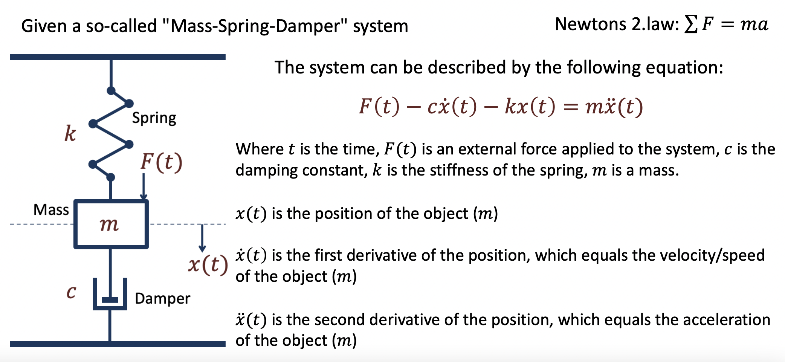
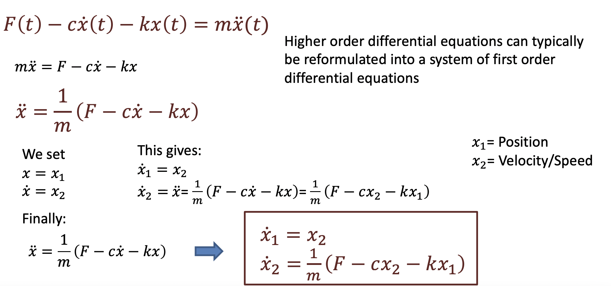
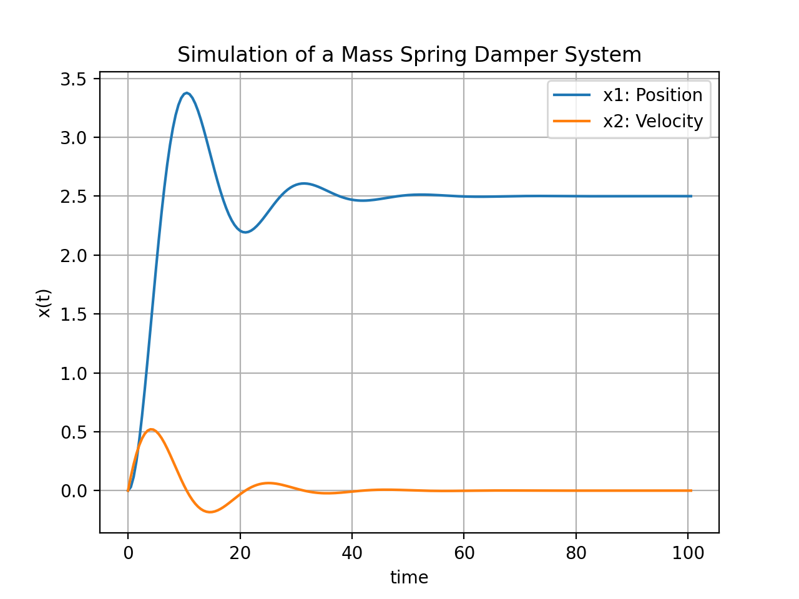
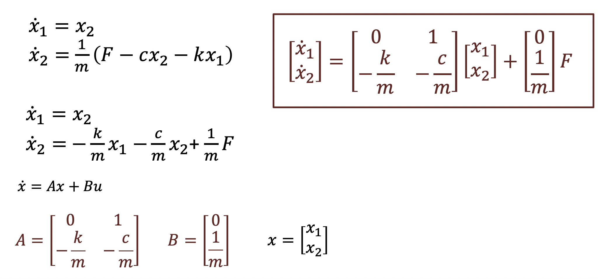
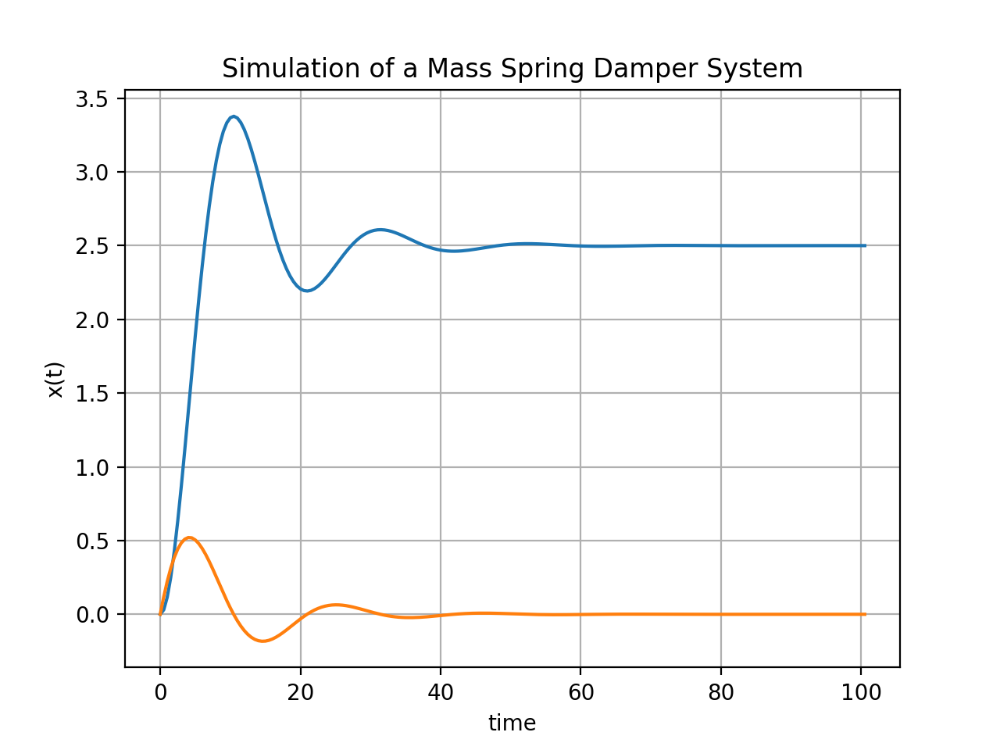
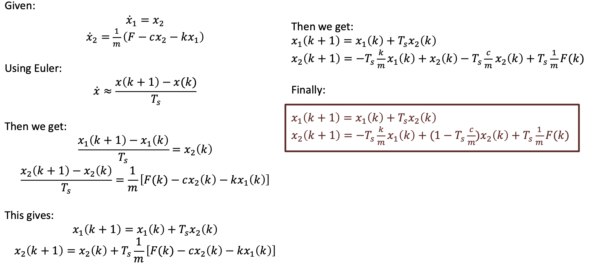
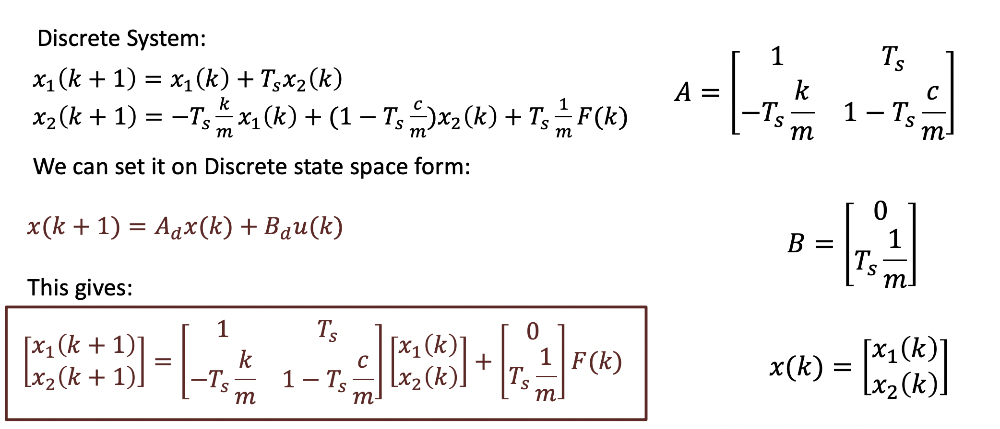

# Mass Spring Damper System
The ”Mass-Spring-Damper“ System is a typical system used to demonstrate and illustrate Modelling and Simulation Applications.  

 

## First Order Differential Equation

 
### Simulation

 

## State Space Model

 
### Simulation

 

## Discretization

 

## Discrete State Space Model
